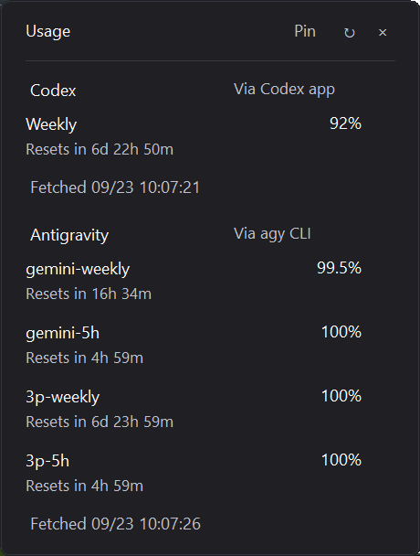
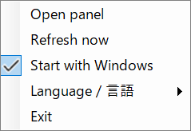

# Codex Limit Viewer

[日本語](README.md)

A sleek, lightweight Windows 11 system tray application that keeps your Codex and Antigravity CLI (`agy`) quota limits always visible in two-line text.


## Features

- **Always Visible**: Glance at your remaining quota percentage (lowest bucket) directly in your Windows 11 notification area.
- **Detailed Breakdown**: Click the tray icon to view per-bucket usage, reset countdowns (days, hours, minutes), and the last updated timestamp.
- **Safe CLI Integration**: Polls your installed official CLIs every 60 seconds. The app never accesses or stores your credentials.
- **Graceful Error Handling**: If a fetch fails, previous values remain visible in gray text rather than disappearing.
- **Bilingual Interface**: Japanese by default, switchable to English anytime via the right-click menu.



## Getting Started

1. **Prerequisites**:
   Install and sign in to the official Codex and/or Antigravity CLI (`agy`). CLI tools are not bundled with this application.
2. **Download**:
   Download and extract the latest release ZIP from [Releases](https://github.com/hinatamaxxx/codex-limit-viewer/releases).
3. **Install**:
   Open PowerShell in the extracted directory and run:
   ```powershell
   powershell -NoProfile -ExecutionPolicy Bypass -File ./Install.ps1
   ```
   - Install path: `%LOCALAPPDATA%/Programs/CodexLimitViewer`
   - Data directory: `%LOCALAPPDATA%/CodexLimitViewer`
4. **Taskbar Settings**:
   Open Windows **Settings > Personalization > Taskbar > Other system tray icons**, turn on the application entries, and keep the 4 slots adjacent.

## Usage



- **Left-Click**: Toggle details popup.
- **Right-Click**: Context menu (Refresh Now, Language, Launch at Startup, Exit).
- **Startup**: Opt-in via the right-click menu (disabled by default).

## Customization

Want to support Claude Code or another provider? Provide this repository URL to Codex or your favorite coding agent and ask it to implement support.
*Note: Requires provider implementation and suitable authentication/API; not built-in by default.*

## Building from Source (Optional)

Build a self-contained binary (no external runtime installation required) using the .NET 10 SDK:

```bash
dotnet publish -c Release --self-contained true -p:PublishSingleFile=true -o dist
```

## Uninstalling

1. Disable startup from the context menu and exit the application.
2. Remove the installation folder, data folder, and Start Menu shortcut:
   - `%LOCALAPPDATA%/Programs/CodexLimitViewer`
   - `%LOCALAPPDATA%/CodexLimitViewer`

## Notes

- Unofficial application.
- Unsigned pre-release software tested on Windows 11 at 150% DPI. Mixed-DPI configurations and reboot startup behavior are unverified.
- License: [MIT License](LICENSE)