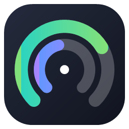
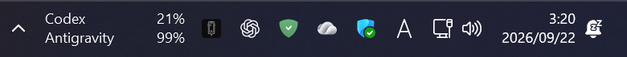
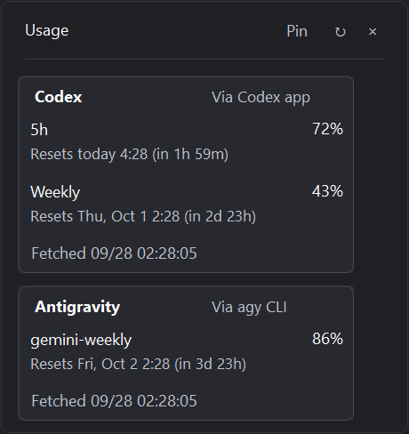
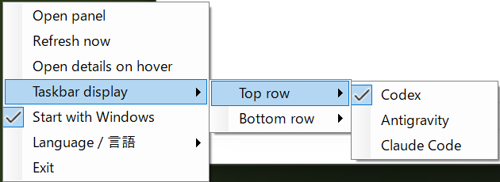

# Codex Limit Viewer

[日本語](README.md)

A sleek, lightweight Windows 11 system tray application that continuously displays remaining quota for two selected services in a two-line layout. Codex and Antigravity CLI (`agy`) are selected by default.



## Features

- **Always Visible**: Glance at your remaining quota percentage (lowest bucket) directly in your Windows 11 notification area without interrupting your work.
- **Choose Two Rows**: Select Codex, Antigravity, Claude Code, or Grok for the top and bottom rows from the right-click menu. Selecting an item already in the other row automatically swaps them.
- **Details on Hover**: Off by default. When enabled, hovering displays per-bucket quota, the reset date and time (today, tomorrow, or weekday and date) with the time left, and the last updated timestamp in a smooth fade popup. It fades out as soon as the pointer leaves both the display and popup. When disabled, a centered tooltip shows the app name. The details popup frames each service in its own card and lists the services shown in the taskbar rows first. Services not shown in the taskbar fold into a one-line summary pinned to the bottom; click the header to open one (the popup keeps its size; the card moves into the list and scrolls into view) or fold it again. Reopening the popup folds them again. Reopening the popup scrolls back to the top.
- **Multi-Service Integration**: Polls Codex (the desktop app's bundled binary or standalone Codex CLI), Antigravity (`agy`), and the official Grok Build CLI every 60 seconds. Claude quota is fetched every minute (the last values are kept across restarts) using your [Claude Code CLI](https://code.claude.com/docs/en/setup) sign-in. The app never stores or transmits credentials, except for sending the Claude sign-in token to Anthropic and renewing the CLI sign-in when it expires.
- **Grok Weekly Quota**: Displays the remaining weekly quota percentage and reset time from the official Grok Build CLI (`grok.exe`) in the details popup. Choose Grok for either taskbar row in the right-click menu.
- **Graceful Error Handling**: If a fetch fails, previous values remain visible in gray text rather than disappearing.
- **Bilingual Interface**: Japanese by default, switchable to English anytime via the right-click menu.
- **Setup and Portable Editions**: Setup installs to one fixed location and replaces the existing app during updates. The portable edition runs from its extracted folder. Installation and startup use files and shortcuts without modifying the registry.



## Getting Started

1. **Prerequisites**:
   - **Codex**: Install and sign in to Codex in the [ChatGPT desktop app](https://learn.chatgpt.com/docs/windows/windows-app), or install the standalone [Codex CLI](https://github.com/openai/codex). Codex requires a local `codex.exe`.
   - **Antigravity**: To display Antigravity quota, install the [Antigravity CLI (`agy`)](https://antigravity.google/docs/cli-install). Note: with agy 1.2.12, `agy -p /usage` is sometimes sent to the model as a prompt (about 12k tokens per call) instead of running the command. When the app detects this, it stops fetching Antigravity for the session so no quota is wasted.
   - **Claude**: To display Claude quota, install the [Claude Code CLI](https://code.claude.com/docs/en/setup) and sign in with `claude auth login`. This also works if you mainly use Claude Desktop, as long as the CLI is signed in to the same account.
   - **Grok**: To display Grok quota, install the [official Grok Build CLI](https://docs.x.ai/build/cli/reference) and sign in with `grok login`.
   *Note: This application does not bundle CLI tools.*
2. **Download**:
   Choose `Setup-win-x64.exe` for regular use or `portable-win-x64.zip` for a portable copy from [Releases](https://github.com/hinatamaxxx/codex-limit-viewer/releases).
3. **Install**:
   Double-click the setup EXE. Updates replace the app in the same folder, keeping one installed version. Setup adds a Start Menu entry and requires no administrator privileges.
   - Install path: `%LOCALAPPDATA%/Programs/CodexLimitViewer`
   - Data directory: `%LOCALAPPDATA%/CodexLimitViewer`
   - Portable edition: Extract the ZIP and run `CodexLimitViewer.exe`. Settings and quota cache are stored in the adjacent `Data` folder. Claude Code status-line integration files and CLI sign-ins are shared with the installed edition. Keep `portable.flag` in place.
4. **Taskbar Settings**:
   Open Windows **Settings > Personalization > Taskbar > Other system tray icons**, turn on all four tray icons for this application, and keep the four slots adjacent on the taskbar.

## Usage



- **Hover**: Opens the details popup (disabled by default). It fades out immediately after the pointer leaves both the tray display and the popup. When disabled, a centered tooltip shows the app name.
- **Left-Click**: Toggles the details popup. A popup opened by click closes immediately upon another click or clicking outside.
- **Right-Click**: Context menu (hover setting, Refresh Now, Language, Launch at Startup, Exit). Changing displayed items or toggles keeps the menu open; click outside to dismiss it.
- **Displayed Services**: In the right-click menu, hover over "Taskbar display" then "Top row" or "Bottom row", and click your desired service (Codex, Antigravity, Claude Code, or Grok). The taskbar stays at two rows.
- **Startup**: Opt-in during setup or via the right-click menu (disabled by default). A single shortcut is created in the Startup folder. If you move a portable folder, turn startup off and on again to update its path.

## Claude Code Integration

After you sign in to the [Claude Code CLI](https://code.claude.com/docs/en/setup), the app uses that sign-in (`~/.claude/.credentials.json`) to query Anthropic’s usage API every minute (when rate-limited, it waits and keeps showing the last values) and shows the 5-hour and weekly remaining quota with reset times. The quota is account-wide, so usage from Claude Desktop and the web is included. The token is only sent to Anthropic and is never stored elsewhere or logged by this app. Because the CLI only renews its sign-in when it calls the model, the app renews an expired sign-in (about every 8 hours) the same way the CLI does and writes it back to the CLI credentials file, keeping all other fields and preferring the CLI’s own renewal if it happened first. The taskbar row reads like “Claude 20%(80%)”: 5-hour remaining, with the weekly remaining in parentheses (Codex plans with a 5-hour limit use the same format). Switch to “Weekly (5-hour) order” under Taskbar display in the right-click menu.

```powershell
claude auth login
```

This is an undocumented internal API and may change. If it is unavailable, the app falls back to the [official status line](https://code.claude.com/docs/en/statusline) bridge (run `EnableClaudeCode.ps1` once from the extracted folder), which supplies values after CLI responses. Missing data appears as “—”, never as 0%.

## Grok Integration

Install the official Grok Build CLI and sign in with `grok login` to see the remaining weekly quota and reset time. This is not a separate per-chat limit for the web version. The app queries the CLI's read-only interface without reading or storing credentials. It refreshes every 60 seconds and shows “—” instead of a misleading 0% when data is unavailable.


To add another provider, give this repository URL to a coding assistant and ask it to implement support.

## Building from Source (Optional)

Build a self-contained binary (no external runtime installation required) using the .NET 10 SDK:

```bash
dotnet publish -c Release --self-contained true -p:PublishSingleFile=true -o dist
```

To build both distribution editions, run `powershell -NoProfile -ExecutionPolicy Bypass -File ./tools/BuildRelease.ps1`. The setup EXE, portable ZIP, and SHA-256 list are created in `release/v<version>/`.

## Uninstalling

For the setup edition, open “Uninstall Codex Limit Viewer” from the Start Menu. It also removes the app and startup shortcuts. Settings and cache are kept by default; choose to remove them in the uninstall window if desired. The Claude Code status-line script is retained so that integration keeps working. This registry-free setup uses the Start Menu for management instead of registering under Windows Settings > Installed apps. Registry entries from earlier versions are left unchanged.

For the portable edition, disable startup, exit the app, and delete its extracted folder.

## Notes

- Unofficial application.
- Unsigned pre-release software tested on Windows 11 at 150% DPI. Mixed-DPI configurations and reboot startup behavior are unverified.
- License: [MIT License](LICENSE)
- Codex with GPT-6 Sol (reasoning effort: Medium) was used for development. The Japanese and English publication text was proofread with Gemini 3.8 Flash (High) (reasoning effort: High).
- Claude Code with Claude Opus 5.5 (reasoning effort: Medium) was used for the v0.1.3–v0.1.18 Claude integration fixes, automatic quota fetching, details ordering and reset-time display, the app icon, and release work.
