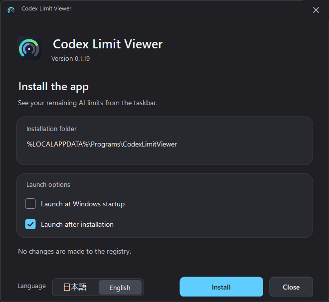

# Codex Limit Viewer

[Download](https://github.com/hinatamaxxx/codex-limit-viewer/releases/tag/v1.0.0) · [日本語](README.md)

See your remaining AI quota in two rows in the Windows 11 system tray. Choose two services from Codex, Antigravity CLI, Claude Code, and Grok Build CLI.


## Features

- Check your remaining quota from the taskbar while you work.
- Click to see quota by service, reset times, and the last fetch time.
- Optionally open details on hover; this is off by default.
- Choose services and switch between Japanese and English from the right-click menu.
- Optionally start the app when you sign in to Windows; this is off by default.


## Prepare your services

**Set up only the services you want to display.** CLI tools are not bundled with this app. Sign in to an account with a quota for each service you use.

| Service | What you need |
| --- | --- |
| Codex | Install and sign in to the Codex desktop app or [Codex CLI](https://github.com/openai/codex). A local `codex.exe` is required. |
| Antigravity | Install and sign in to [Antigravity CLI (agy)](https://antigravity.google/docs/cli-install). See the limitation below. |
| Claude | Install [Claude Code CLI](https://code.claude.com/docs/en/setup) and run `claude auth login`. To show quota for your Claude Desktop or web account, sign in to the CLI with the same account. |
| Grok | Install the [official Grok Build CLI](https://docs.x.ai/build/cli/reference) and run `grok login`. The app displays the CLI's weekly quota. |

Antigravity quota may be unavailable with some agy versions. With agy 1.2.12, the quota command can run as a model prompt and consume quota. If the app detects this, it stops fetching Antigravity until the app is restarted.

## Download and start

### Setup edition

Choose this edition for regular use.

1. Download `Codex-Limit-Viewer-v1.0.0-Setup-win-x64.exe` from the [release page](https://github.com/hinatamaxxx/codex-limit-viewer/releases/tag/v1.0.0).
2. Run the EXE and click “Install.” No administrator privileges are required.
3. After installation, launch “Codex Limit Viewer” from the Start Menu.



### Portable edition

Choose this edition to run the app from an extracted folder without installation.

1. Download and extract `Codex-Limit-Viewer-v1.0.0-portable-win-x64.zip`.
2. Run `CodexLimitViewer.exe` in the folder.

Keep `portable.flag` in place. Settings and quota cache are stored in the adjacent `Data` folder. CLI sign-ins and Claude Code status-line integration files are shared with the setup edition. Only one copy can run in the same Windows session, including across both editions.

### Keep the display visible

In Windows **Settings → Personalization → Taskbar → Other system tray icons**, turn on **all four tray icons** for this app. Keep the four icons adjacent to form the two-row quota display.

## Using the app


| Action | Result |
| --- | --- |
| Left-click | Open details. Click again or outside the popup to close it. |
| Right-click | Choose displayed services, refresh now, change hover behavior, select a language, or set startup. Choose “Exit” to stop the app. |
| “Taskbar display” → “Top row / Bottom row” | Choose a service. Selecting the service already in the other row swaps the rows. |
| Enable “Open details on hover” | Hover over the quota display to open details. Move the pointer outside both the display and popup to close it. |

Details list your taskbar services first. Other services are folded at the bottom; click a heading to open its contents.

For Codex and Claude plans with both 5-hour and weekly quotas, a value such as “20%(80%)” shows 5-hour remaining first and weekly remaining in parentheses. Choose “Weekly (5-hour) order” under “Taskbar display” to reverse the order.

Quota normally refreshes every minute. During rate limits, the app keeps the last values. Previously fetched values turn gray if fetching fails; “—” means no value has been fetched yet.


## Startup and updates

Enable startup in setup or from the right-click menu. If you move a portable folder, turn startup off and on again to update its path.

To update the setup edition, run the new setup EXE. It keeps your settings and replaces the app in the same folder. The install folder is `%LOCALAPPDATA%\Programs\CodexLimitViewer`; settings and cache are in `%LOCALAPPDATA%\CodexLimitViewer`.

To update the portable edition, exit the app and extract the new ZIP. To keep your settings, copy the original `Data` folder beside the new EXE. Update startup settings if the folder changes.

If startup is duplicated after moving from an earlier version, disable the old entry in Windows **Settings → Apps → Startup**.

## If Claude quota is missing

First run `claude auth login` in Claude Code CLI to check your sign-in. The app normally uses this sign-in to fetch 5-hour and weekly quota. Quota is account-wide, so usage from Claude Desktop and the web is included.

Automatic fetching uses an undocumented Anthropic API that may change. If it becomes unavailable, enable the [official status line](https://code.claude.com/docs/en/statusline) bridge to display quota supplied after Claude Code CLI responses. For the setup edition, run this once in PowerShell:

```powershell
powershell -NoProfile -ExecutionPolicy Bypass -File "$env:LOCALAPPDATA\Programs\CodexLimitViewer\EnableClaudeCode.ps1"
```

For the portable edition, run `EnableClaudeCode.ps1` in the extracted folder. This bridge updates when you use Claude Code CLI.

## Data and sign-ins

Settings and quota cache are stored on this PC. The app uses Claude's sign-in only for quota requests and authentication renewal with Anthropic. If it expires, the app renews the CLI sign-in and writes it back to the CLI credentials file. Credentials are not copied to a separate app-owned location or written to logs.

Installation and startup settings do not change the registry. The app is not listed in Windows Settings → Installed apps; use the Start Menu to launch or uninstall it.

## Uninstalling

- **Setup edition**: Open “Uninstall Codex Limit Viewer” from the Start Menu. Settings and cache are kept by default, with an option to remove them. The Claude Code status-line bridge script is retained.
- **Portable edition**: Disable startup, exit the app, and delete the extracted folder.

Disable startup entries created by earlier versions through their settings or Windows “Startup.”

## Requirements and limitations

- Unofficial, unsigned app for Windows 11 x64. No additional .NET runtime installation is required.
- Mixed-DPI monitors and startup after a reboot are unverified.
- Service or CLI changes may prevent quota fetching. Grok support covers the Grok Build CLI weekly quota, not separate per-chat limits on the web.
- Available under the [MIT License](LICENSE).

Development assistance: Codex (GPT-6 Sol / Medium, GPT-6.1 Sol / Ultra and High) and Claude Code (Claude Opus 5.5 / Medium). Japanese and English proofreading: Gemini 3.8 Flash (High) / High. The values following each model name are reasoning-effort settings.
