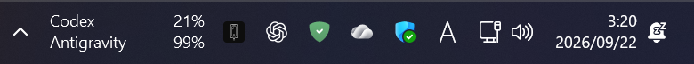
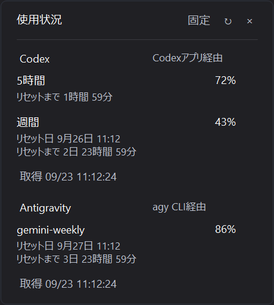
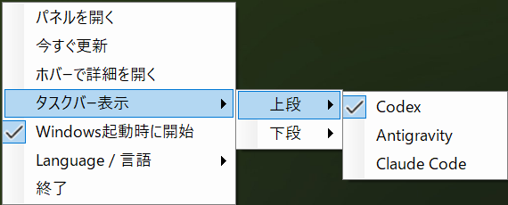

# Codex Limit Viewer

[English](README.en.md)

Windows 11のタスクバー通知領域（システムトレイ）に、選択した2つのサービスの利用枠残量を常時2行でスマートに表示する軽量ツールです。初期設定はCodexとAntigravity CLI（`agy`）です。



## 主な特徴

- **常時モニタリング**: タスクバー上に残量（最も低いバケットの割合）を常に表示。作業の手を止めずに残り枠を一目で把握できます。
- **2行の表示を選択**: 右クリックの「タスクバー表示」で、上段と下段にCodex、Antigravity、Claude Codeから選べます。同じ項目を選ぶと上下が入れ替わります。
- **ホバーで詳細確認**: 初期状態はオフです。オンにすると各バケットの詳細残量、リセットまでの時間（日数・時間・分）、翌日以降のリセット日、最終取得時刻がフェード表示され、カーソルが表示領域を離れるとすぐ消え始めます。オフのときはWindows標準のツールチップでアプリ名を表示します。
- **CodexとAntigravity CLIに連携**: Codexはデスクトップアプリに同梱された実行ファイルを優先し、なければ単独のCodex CLIを使います。Antigravityは`agy`を使います。60秒ごとに取得し、本アプリは認証情報を抽出・保持しません。Claude Codeは公式のstatus lineから使用率を受け取ります。
- **エラー時の安心表示**: 取得に失敗した場合は前回の数値をグレーで維持表示し、急な表示消去を防ぎます。
- **バイリンガル対応**: 日本語を標準搭載。右クリックメニューから英語表記へ簡単に切り替え可能です。



## はじめ方

1. **事前準備**:
   [ChatGPTデスクトップアプリ](https://learn.chatgpt.com/docs/windows/windows-app)のCodex機能、または単独の [Codex CLI](https://github.com/openai/codex) をインストールしてログインします。Codex側はローカルに`codex.exe`がある構成で動作します。Antigravityの残量も表示する場合は [Antigravity CLI (`agy`)](https://antigravity.google/docs/cli-install) も必要です。本アプリにCLI本体は同梱されていません。
2. **ダウンロード**:
   [Releases](https://github.com/hinatamaxxx/codex-limit-viewer/releases) より最新のZIPファイルをダウンロードし、展開します。
3. **インストール**:
   展開したフォルダ内でPowerShellを開き、以下を実行します。
   ```powershell
   powershell -NoProfile -ExecutionPolicy Bypass -File ./Install.ps1
   ```
   - インストール先: `%LOCALAPPDATA%/Programs/CodexLimitViewer`
   - データ保存先: `%LOCALAPPDATA%/CodexLimitViewer`
4. **タスクバーの表示設定**:
   Windowsの「設定」>「個人用設定」>「タスクバー」>「その他のシステム トレイ アイコン」を開き、本アプリの項目をオンに設定して、4つのスロットが隣り合うように配置してください。

## 使い方



- **ホバー**: 詳細ウィンドウを開きます（初期状態はオフ）。残量表示と詳細画面の両方からカーソルを離すと、待たずにフェードして閉じます。オフではWindows標準のツールチップでアプリ名を表示します。
- **左クリック**: 詳細ウィンドウの表示 / 非表示。クリックで開いた詳細は即時に閉じます。
- **右クリック**: メニュー表示（ホバー表示のオン / オフ、今すぐ更新、言語切り替え、スタートアップ設定、終了）。表示項目やオン / オフを変えてもメニューは開いたままで、外側をクリックすると閉じます。
- **表示するサービス**: 右クリック後、「タスクバー表示」→「上段／下段」にホバーするとCodex、Antigravity、Claude Codeの一覧が開きます。クリックは最後の項目選択だけです。タスクバーは常に2行です。
- **スタートアップ起動**: 右クリックメニューから任意で有効化できます（初期状態はオフ）。

## Claude Codeの連携

[Claude Codeの公式status line](https://code.claude.com/docs/en/statusline)に含まれる5時間・7日間の使用率を読み取ります。Claude Codeを利用できるプランで、展開したフォルダから次を一度実行してください。

```powershell
powershell -NoProfile -ExecutionPolicy Bypass -File ./EnableClaudeCode.ps1
```

既存のstatus lineがある場合は上書きしません。新しく設定する場合は元の設定をバックアップし、受け取った使用率と取得時刻だけをローカルに保存します。Claude Codeの応答後に数値が届くと詳細欄に現れ、「タスクバー表示」で選択した場合は2行のうちの1行に表示します。データがない間は「—」と表示し、0%とは扱いません。[公式のプラン表](https://support.claude.com/en/articles/10065433-install-claude-desktop)では無料プランにClaude Codeは含まれず、[status lineの使用率欄](https://code.claude.com/docs/en/statusline)も主にPro/Maxプラン向けです。Claude DesktopをインストールしただけではClaude Codeの数値は取得できません。

他のプロバイダーへの対応を追加したい場合は、本リポジトリのURLをCodex等のAIアシスタントに渡して依頼できます。

## 開発者向けビルド（任意）

.NET 10 SDK を使用して、追加のランタイム不要な自己完結型バイナリをビルドできます。

```bash
dotnet publish -c Release --self-contained true -p:PublishSingleFile=true -o dist
```

## アンインストール

1. 右クリックメニューから「スタートアップ」をオフにし、アプリを「終了」します。
2. 以下のフォルダおよびスタートメニューのショートカットを削除してください。
   - `%LOCALAPPDATA%/Programs/CodexLimitViewer`
   - `%LOCALAPPDATA%/CodexLimitViewer`

## 注意事項

- 本ソフトウェアは非公式ツールです。
- 未署名のプレリリース版です。Windows 11（150% DPI環境）で動作確認を行っています。マルチモニタ（異なるDPI設定）や再起動直後の自動起動挙動は未検証です。
- ライセンス: [MIT License](LICENSE)
