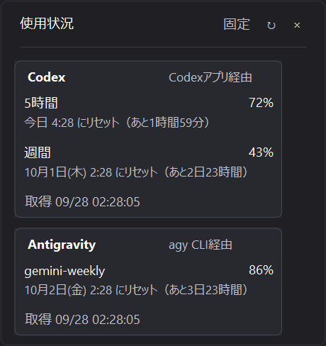
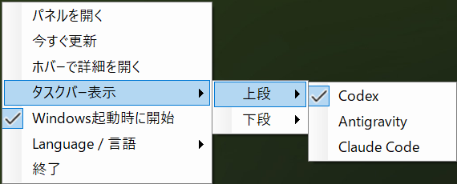

# Codex Limit Viewer

[English](README.en.md)

Windows 11のタスクバー通知領域（システムトレイ）に、選択した2つのサービスの利用枠残量を常時2行でスマートに表示する軽量ツールです。初期設定ではCodexとAntigravity CLI（`agy`）が表示されます。


## 主な特徴

- **常時モニタリング**: タスクバー上に残量（最も低いバケットの割合）を常に表示。作業の手を止めずに残り枠を一目で把握できます。
- **2行の表示を選択**: 右クリックメニューの「タスクバー表示」から、上段と下段にCodex、Antigravity、Claude Code、Grokを割り当てられます。すでに別の段で選択されている項目を選ぶと上下が自動で入れ替わります。
- **ホバーで詳細確認**: 初期状態はオフです。有効にすると、各バケットの詳細残量、リセット日時（今日・明日、または日付と曜日）と残り時間、最終取得時刻がフェード表示されます。カーソルが表示領域および詳細画面を離れると速やかに消えます。オフのときは中央にアプリ名のツールチップを表示します。詳細画面では、サービスごとに枠で囲んで表示し、タスクバーの上段・下段に表示しているサービスを先頭に並べます。タスクバーに表示していないサービスは、見出しと残り%の1行に折りたたまれて画面の下に固定され、見出しをクリックすると開閉できます（詳細画面の大きさは変わらず、開くと一覧に移ってその位置までスクロールします。詳細画面を開き直すと、再び折りたたまれた状態に戻ります）。詳細画面を開き直すと、スクロール位置は先頭に戻ります。
- **4つのサービス連携**: Codexはデスクトップアプリ同梱または単独のCodex CLI、Antigravityは`agy`、Grokは公式Grok Build CLIから60秒ごとに取得します。Claudeは[Claude Code CLI](https://code.claude.com/docs/en/setup)のログインを使って3分ごとに取得し、最後に取得した残量を保存して再起動直後も表示します。本アプリが認証情報を保存・送信することはありません（Claudeのログイン情報をAnthropicへ送り、期限切れ時にCLIのログイン情報を更新する場合を除く）。
- **Grokの週次利用枠**: 公式Grok Build CLI（`grok.exe`）から残り割合とリセット日時を取得し、詳細画面に表示します。右クリックメニューの「タスクバー表示」で上段または下段にも表示できます。
- **エラー時の安心表示**: 取得に失敗した場合は前回の数値をグレーで維持表示し、表示のチラつきや急な消失を防ぎます。
- **バイリンガル対応**: 日本語を標準搭載。右クリックメニューからいつでも英語表記へ切り替え可能です。



## はじめ方

1. **事前準備**:
   - **Codex**: [ChatGPTデスクトップアプリ](https://learn.chatgpt.com/docs/windows/windows-app)のCodex機能、または単独の [Codex CLI](https://github.com/openai/codex) をインストールしてログインします。Codex側はローカルに`codex.exe`がある構成で動作します。
   - **Antigravity**: 残量を表示する場合は [Antigravity CLI (`agy`)](https://antigravity.google/docs/cli-install) も必要です。※ agy 1.2.12 では、`agy -p /usage` がコマンドとして処理されず、モデルへの依頼になる（1回あたり約1.2万トークンを消費する）ことがあります。本アプリはこれを検出すると、使用量を無駄に消費しないよう、そのセッション中は Antigravity の取得を停止します。
   - **Claude**: 残量を表示する場合は、[Claude Code CLI](https://code.claude.com/docs/en/setup)をインストールし、`claude auth login`でログインします。Claude Desktopだけを使う場合も、同じアカウントでCLIにログインしておけば表示できます。
   - **Grok**: 残量を表示する場合は、[公式Grok Build CLI](https://docs.x.ai/build/cli/reference)をインストールし、`grok login`でログインします。
   ※ 本アプリにCLIツール本体は同梱されていません。
2. **ダウンロード**:
   [Releases](https://github.com/hinatamaxxx/codex-limit-viewer/releases) より最新のZIPファイルをダウンロードし、展開します。
3. **インストール**:
   展開したフォルダ内でPowerShellを開き、以下を実行します。
   ```powershell
   powershell -NoProfile -ExecutionPolicy Bypass -File ./Install.ps1
   ```
   - インストール先: `%LOCALAPPDATA%/Programs/CodexLimitViewer`
   - データ保存先: `%LOCALAPPDATA%/CodexLimitViewer`
4. **タスクバーの表示設定**:
   Windowsの「設定」>「個人用設定」>「タスクバー」>「その他のシステム トレイ アイコン」を開き、本アプリの項目（4つのトレイアイコン）をすべてオンにして、4つのスロットが隣り合うように配置してください。

## 使い方



- **ホバー**: 詳細ウィンドウを開きます（初期状態はオフ）。残量表示と詳細画面の両方からカーソルを離すと、待たずにフェードして閉じます。オフ時は中央にアプリ名のツールチップを表示します。
- **左クリック**: 詳細ウィンドウの表示 / 非表示を切り替えます。クリックで開いた詳細ウィンドウは、再度クリックするか外側をクリックすると即時に閉じます。
- **右クリック**: メニュー表示（ホバー表示のオン / オフ、今すぐ更新、言語切り替え、スタートアップ設定、終了）。表示項目や設定を変更してもメニューは開いたまま維持され、外側をクリックすると閉じます。
- **表示するサービス**: 右クリックメニューの「タスクバー表示」→「上段／下段」にカーソルを合わせるとCodex、Antigravity、Claude Code、Grokの一覧が開きます。クリックは最後の項目選択だけです。タスクバーは常に2行構成です。
- **スタートアップ起動**: 右クリックメニューからWindows起動時の自動起動を有効化できます（初期状態はオフ）。

## Claude Codeの連携

[Claude Code CLI](https://code.claude.com/docs/en/setup)にログインすると、そのログイン情報（`~/.claude/.credentials.json`）を使ってAnthropicの使用状況APIに3分ごとに問い合わせ（APIが短い間隔の問い合わせを制限するため）、5時間・週間の残量とリセット時刻を表示します。残量はアカウント全体の値のため、Claude DesktopやWeb版での利用も反映されます。ログイン情報はAnthropicへの問い合わせだけに使い、本アプリが別の場所に保存・記録することはありません。CLIはモデルを呼び出すときにしかログインを更新しないため、有効期限（約8時間）が切れた場合は、本アプリがCLIと同じ手順で更新し、CLIのログイン情報ファイルに書き戻します（ほかの項目はそのまま残し、CLIが先に更新していればその値を使います）。タスクバーでは「Claude 20%(80%)」のように、5時間の残りと、括弧内に週間の残りを表示します（5時間制限のあるプランのCodexも同じ形式で表示します）。右クリックメニューの「タスクバー表示」で「週間（5時間）の順」に切り替えられます。

```powershell
claude auth login
```

このAPIは公開ドキュメントのない内部APIのため、将来変更される可能性があります。取得できないときは、従来の[公式status line](https://code.claude.com/docs/en/statusline)の連携（展開したフォルダで`EnableClaudeCode.ps1`を一度実行）で、CLIの応答後に届いた数値を代わりに表示します。データがない間は「—」と表示し、0%とは区別します。

## Grokの連携

公式Grok Build CLIをインストールして`grok login`でログインすると、週次利用枠の残り割合とリセット日時を表示できます。Web版チャットの個別回数制限ではありません。本アプリはCLIの読み取り用インターフェースに問い合わせ、認証情報を読み取ったり保存したりしません。60秒ごとに更新し、取得できない場合は0%と誤表示せず「—」を表示します。


他のプロバイダーへの対応を追加したい場合は、本リポジトリのURLをCodex等のAIアシスタントに渡して依頼できます。

## 開発者向けビルド（任意）

.NET 10 SDK を使用して、追加のランタイム不要な自己完結型バイナリをビルドできます。

```bash
dotnet publish -c Release --self-contained true -p:PublishSingleFile=true -o dist
```

## アンインストール

1. 右クリックメニューから「スタートアップ」をオフにし、アプリを「終了」します。
2. 以下のフォルダおよびスタートメニューのショートカットを削除してください。
   - `%LOCALAPPDATA%/Programs/CodexLimitViewer`
   - `%LOCALAPPDATA%/CodexLimitViewer`

## 注意事項

- 本ソフトウェアは非公式ツールです。
- 未署名のプレリリース版です。Windows 11（150% DPI環境）で動作確認を行っています。マルチモニタ（異なるDPI設定）や再起動直後の自動起動挙動は未検証です。
- ライセンス: [MIT License](LICENSE)
- 開発にはGPT-6 Sol（推論設定: Medium／中）のCodexを使用し、日本語・英語の公開文はGemini 3.8 Flash (High)（推論設定: High）で校正しました。
- v0.1.3〜v0.1.16のClaude連携の修正・自動取得、詳細画面の表示順とリセット日時表示の改善、アプリアイコンの作成、リリース作業にはClaude Code（Claude Opus 5.5、推論設定: Medium／中）を使用しました。
