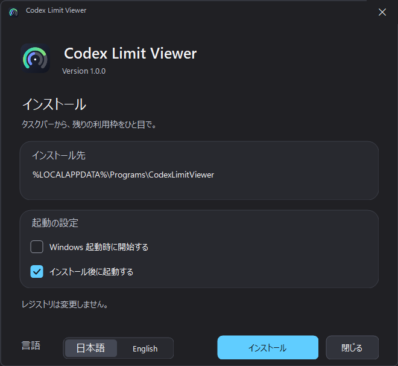

# Codex Limit Viewer

[ダウンロード](https://github.com/hinatamaxxx/codex-limit-viewer/releases/tag/v1.0.0) · [English](README.en.md)

Windows 11の通知領域に、AIサービスの利用枠の残り割合を2行で表示するアプリです。Codex、Antigravity CLI、Claude Code、Grok Build CLIから、表示する2つのサービスを選べます。


## できること

- 作業中も、タスクバーで残量をひと目で確認できます。
- クリックすると、サービスごとの残量、リセット日時、最終取得時刻を表示します。
- 詳細をホバーで表示することもできます。初期設定はオフです。
- 表示するサービスと、日本語・英語の言語を右クリックメニューから選べます。
- Windowsへのサインイン時に自動起動できます。初期設定はオフです。


## 利用するサービスの準備

**表示したいサービスだけ準備してください。** CLIツールは本アプリには同梱していません。各サービスの利用枠があるアカウントへのログインが必要です。

| サービス | 準備するもの |
| --- | --- |
| Codex | Codexデスクトップアプリ、または[Codex CLI](https://github.com/openai/codex)をインストールしてログインします。ローカルに`codex.exe`が必要です。 |
| Antigravity | [Antigravity CLI（agy）](https://antigravity.google/docs/cli-install)をインストールしてログインします。下記の制限もご確認ください。 |
| Claude | [Claude Code CLI](https://code.claude.com/docs/en/setup)をインストールし、`claude auth login`でログインします。Claude DesktopやWeb版で使っているアカウントも、同じアカウントでCLIにログインすれば残量を表示できます。 |
| Grok | [公式Grok Build CLI](https://docs.x.ai/build/cli/reference)をインストールし、`grok login`でログインします。対象はCLIの週次利用枠です。 |

Antigravityは、agyのバージョンによって残量を取得できない場合があります。agy 1.2.12では、残量取得のコマンドがモデルへの依頼として実行され、利用枠を消費することがあります。本アプリはこれを検出すると、その起動中はAntigravityの取得を停止します。

## ダウンロードと起動

### セットアップ版

通常はこちらを選んでください。

1. [リリースページ](https://github.com/hinatamaxxx/codex-limit-viewer/releases/tag/v1.0.0)から`Codex-Limit-Viewer-v1.0.0-Setup-win-x64.exe`をダウンロードします。
2. EXEを実行し、「インストール」をクリックします。管理者権限は不要です。
3. インストール後は、スタートメニューの「Codex Limit Viewer」から起動できます。



### portable版

インストールせず、展開したフォルダから使いたい場合はこちらを選んでください。

1. `Codex-Limit-Viewer-v1.0.0-portable-win-x64.zip`をダウンロードして展開します。
2. フォルダ内の`CodexLimitViewer.exe`を起動します。

`portable.flag`は削除しないでください。設定と残量キャッシュは、EXEの隣の`Data`フォルダに保存されます。CLIのログイン情報とClaude Codeのstatus line連携用ファイルは、セットアップ版と共通です。同じWindowsセッションで起動できるのは、両方の版を合わせて1つです。

### 通知領域に常時表示する

Windowsの「設定」→「個人用設定」→「タスクバー」→「その他のシステム トレイ アイコン」で、本アプリの**4つのトレイアイコンをすべてオン**にしてください。4つが隣り合うように並べると、2行の残量表示になります。

## 使い方


| 操作 | 動作 |
| --- | --- |
| 左クリック | 詳細画面を開きます。もう一度クリックするか、画面の外側をクリックすると閉じます。 |
| 右クリック | 表示項目、今すぐ更新、ホバー表示、言語、自動起動を設定できます。「終了」でアプリを終了します。 |
| 「タスクバー表示」→「上段／下段」 | 表示するサービスを選びます。もう一方の段と同じ項目を選ぶと、上下が入れ替わります。 |
| 「ホバーで詳細を開く」をオン | 残量表示にカーソルを合わせると詳細を開きます。残量表示と詳細画面の両方からカーソルを離すと閉じます。 |

詳細画面では、タスクバーに表示しているサービスが先頭に並びます。他のサービスは下部に折りたたまれ、見出しをクリックすると内容を開けます。

CodexとClaudeで5時間枠と週間枠がある場合は、「20%(80%)」のように表示します。先頭は5時間枠、括弧内は週間枠の残量です。「タスクバー表示」から「週間（5時間）の順」に切り替えられます。

残量は通常1分ごとに更新されます。問い合わせ制限中は前回の値を表示します。取得できなくなった値はグレーで表示し、まだ取得できていない場合は「—」と表示します。


## 自動起動と更新

自動起動は、セットアップ画面または右クリックメニューで有効にできます。portable版のフォルダを移動した場合は、自動起動を一度オフにしてから再度オンにしてください。

セットアップ版は新しいセットアップEXEを実行すると、設定を保ったまま同じ場所へ更新できます。インストール先は`%LOCALAPPDATA%\Programs\CodexLimitViewer`、設定とキャッシュの保存先は`%LOCALAPPDATA%\CodexLimitViewer`です。

portable版はアプリを終了し、新しいZIPを展開してください。設定を引き継ぐには、元の`Data`フォルダを新しいEXEの隣にコピーします。フォルダが変わる場合は、自動起動の設定も更新してください。

以前の版から移行して自動起動が重複する場合は、Windowsの「設定」→「アプリ」→「スタートアップ」で古い項目を無効にしてください。

## Claudeの残量が表示されない場合

まず、Claude Code CLIで`claude auth login`を実行し、ログインを確認してください。通常は、そのログイン情報を使って5時間・週間の残量を取得します。残量はアカウント全体の値なので、Claude DesktopやWeb版での利用も反映されます。

自動取得に使うAnthropicのAPIは非公開で、仕様変更により取得できなくなる場合があります。その場合は、[公式status line](https://code.claude.com/docs/en/statusline)の連携を有効にすると、Claude Code CLIの応答後に届く残量を表示できます。セットアップ版では、PowerShellで次を一度実行してください。

```powershell
powershell -NoProfile -ExecutionPolicy Bypass -File "$env:LOCALAPPDATA\Programs\CodexLimitViewer\EnableClaudeCode.ps1"
```

portable版は、展開フォルダの`EnableClaudeCode.ps1`を実行してください。この連携はClaude Code CLIを使ったときに更新されます。

## データとログイン情報

設定と残量キャッシュはこのPCに保存します。Claudeのログイン情報はAnthropicへの残量取得・認証更新に使用します。有効期限が切れた場合はCLIのログイン情報を更新し、CLIの認証ファイルに書き戻します。本アプリ専用の場所に認証情報を保存したり、ログに記録したりすることはありません。

インストールと自動起動の設定ではレジストリを変更しません。Windows設定の「インストールされているアプリ」には登録されないため、起動と削除はスタートメニューから行ってください。

## アンインストール

- **セットアップ版**: スタートメニューの「Uninstall Codex Limit Viewer」を開きます。設定とキャッシュは初期状態では残り、削除を選ぶこともできます。Claude Codeのstatus line連携用スクリプトは残ります。
- **portable版**: 自動起動をオフにし、アプリを終了して展開フォルダを削除します。

以前の版が登録した自動起動項目は、その版の設定またはWindowsの「スタートアップ」から無効にしてください。

## 対応環境・注意事項

- Windows 11 x64向けの非公式・未署名アプリです。追加の.NETランタイムのインストールは不要です。
- 異なる表示倍率の複数モニターと、再起動後の自動起動は動作未確認です。
- 各サービスの仕様やCLIの更新により、残量を取得できなくなる場合があります。Grokの対象はGrok Build CLIの週次利用枠で、Web版チャットの個別回数制限ではありません。
- [MITライセンス](LICENSE)で利用できます。

制作協力: Codex（GPT-6 Sol / Medium、GPT-6.1 Sol / Ultra・High）、Claude Code（Claude Opus 5.5 / Medium）。日本語・英語の公開文の校正: Gemini 3.8 Flash (High) / High。各モデルの後ろに記載した値は推論設定です。
